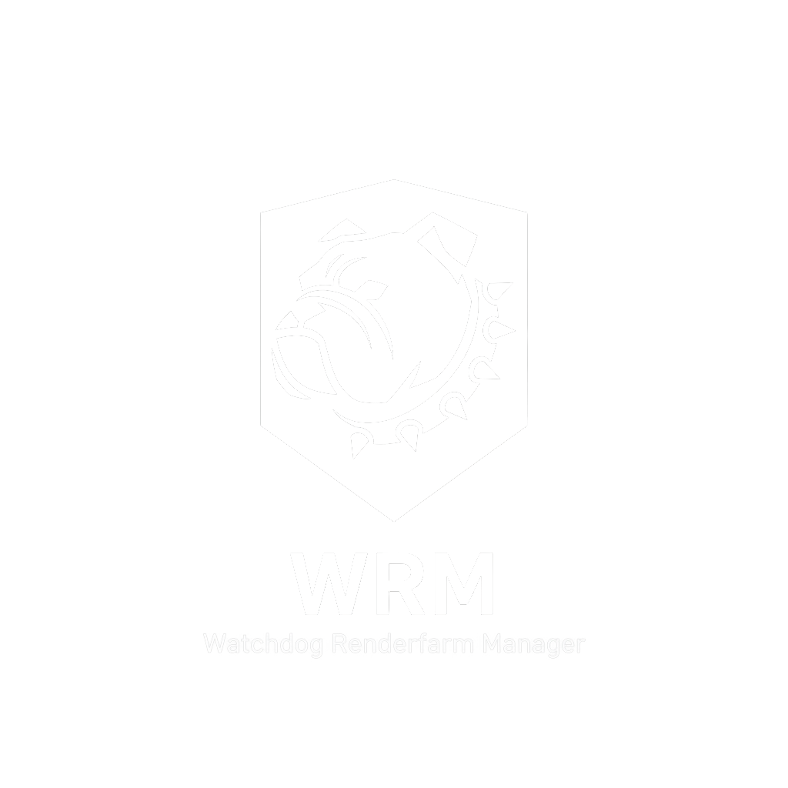

<p align="center">
  
</p>

# Watchdog Renderfarm Manager (WRM)


A lightweight **PowerShell render node watchdog and cluster manager** designed for [**Flamenco render farms**](https://flamenco.blender.org).

WRM runs quietly in the **Windows system tray**, monitoring nodes, automatically restarting crashed services, and providing a live cluster overview—all without requiring a dedicated management server.

---

## ✨ Why WRM?

Standard Flamenco worker and manager run in visible console windows which can be cluttered and easily closed by accident. Furthermore, Flamenco doesn't natively handle service crashes or silent node failures. 

**WRM solves this by:**
* **Running Stealth**: No more taskbar clutter; Flamenco runs in the background.
* **Self-Healing**: Detects crashes and restarts services (or the OS) automatically.
* **Live Insight**: Real-time CPU/GPU monitoring directly from your system tray, on any node.
* **Zero Config**: Uses UDP broadcast for instant "it just works" discovery.

---

## 🚀 Features

### 🛡️ Automatic Recovery
* **Crash Detection**: Restarts Worker/Manager processes immediately upon failure.
* **Self-Correction**: Identifies and kills duplicate worker instances.
* **System Health**: Triggers a system reboot after repeated service crashes or on a weekly schedule (default: Sundays at 12:00).

### 📡 Cluster Discovery & Monitoring
Nodes communicate via **UDP broadcast** to share:
* **Status**: Worker/Manager online/offline states.
* **Hardware**: Live CPU & GPU usage (via NVIDIA SMI).
* **Remote Control**: Restart specific nodes or the entire farm with one click.

> [!NOTE]
> **Scalability**: This system has been tested with up to **4 nodes** with negligible CPU and RAM overhead. Larger clusters may experience unexpected CPU spikes or increased memory usage due to the frequency of UDP broadcasts. This has not been tested.


### 🖼️ Tray UI Overview
The tray menu provides a bird's-eye view of your entire network:
```text
Network Nodes
  [Restart All Nodes]

  Render01   ●●   CPU 93%  GPU 99%
  Render02   ●●   CPU 81%  GPU 96%
  Render03   ●○   CPU 12%  GPU 0%
```
*   ●● : Both Worker & Manager Active
*   ●○ : Worker Only Active
*   ○○ : Node Offline

---

## 🛠️ Installation Guide

### 1. Prerequisites
* **Flamenco**: Follow the [Official Quickstart](https://flamenco.blender.org).
* **Drivers**: NVIDIA drivers with `nvidia-smi` (for GPU monitoring).
* **Network**: Open **Port 25565** (UDP) for inbound/outbound traffic.
* **OS Settings**: Disable Windows login passwords to allow nodes to auto-resume after reboots.

### 2. File Placement
Place the script and icon in any directory on each node (note the location):
```text
rendernode
 ├─ WatchdogRenderfarmManager.ps1
 └─ wrm_icon.ico
```

### 3. Setup Auto-Start
1. Press `Win + R`, type `shell:startup`, and hit Enter.
2. Create a **New Shortcut** and paste the command (update the path to your `WatchdogRenderfarmManager`) and the directory to to Flamenco shared folder (defaults to Z:\):

**For Workers:**
```powershell
powershell.exe -ExecutionPolicy Bypass -WindowStyle Hidden -File "Drive:\Path\to\WatchdogRenderfarmManager.ps1" -Mode Worker -BaseDir Z:\
```

**For the Manager:**
```powershell
powershell.exe -ExecutionPolicy Bypass -WindowStyle Hidden -File "Drive:\Path\to\WatchdogRenderfarmManager.ps1" -Mode Manager -BaseDir Z:\
```

---

## ⚙️ Configuration & Logs
You can tweak the following variables directly inside the `.ps1` file:
* `$watchdog = "Watchdog Renderfarm Manager"` - Name of watchdog
* `$WorkerPath  = Join-Path $BaseDir "flamenco-worker.exe"`
* `$ManagerPath = Join-Path $BaseDir "flamenco-manager.exe"`
* `$LogFile     = Join-Path $BaseDir "Watchdog.log"`
* `$IconPath = Join-Path $PSScriptRoot "wrm.ico"`
* `$CheckIntervalSeconds = 5` - How often to check for crashes/restarts etc
* `$CrashRestartThreshold = 3` - Max Crashes before computer restarts - set this higher if you get constant restart loops
* `$WeeklyRestartDay = "Sunday"`
* `$WeeklyRestartHour = 12`
* `$BroadcastPort = 25565` - Port to send and recieve node information.

**Logs**: Check `Watchdog.log` in the shared folder for a history of crashes, restarts, and status changes.

---

## 🔍 Troubleshooting

* **"Scripts Disabled"**: Right-click the `.ps1` file > **Properties** > Check **Unblock**. 
* **Missing Icon**: Ensure `wrm_icon.ico` is in the same folder as the script.
* **Nodes Not Appearing**: Ensure all machines are on the same LAN/Subnet and that your Firewall isn't blocking UDP Port 25565.
* **Hidden nodes**: The system is only tested with up to 4 Nodes, if the list is too long or unexpected 

---

<p align="center">
  <a href="https://flamenco.blender.org">
    Visit the Flamenco Project
  </a>
</p>
